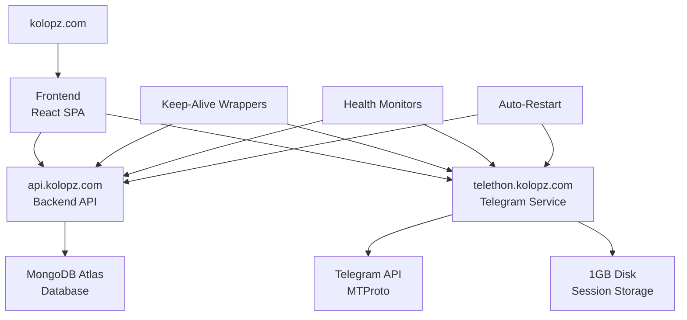

# 🚀 KOL Tracker Pro - kolopz.com Production Deployment

Complete guide for deploying your KOL Tracker to **kolopz.com** with always-on services on Render.

---

## 🌐 **Domain Structure**

| Service | Domain | Purpose |
|---------|--------|---------|
| **Frontend** | `kolopz.com`, `www.kolopz.com` | Main web application |
| **Backend API** | `api.kolopz.com` | Node.js API server |
| **Telethon** | `telethon.kolopz.com` | Python Telegram service |

---

## 🚀 **Quick Deploy**

### **1. Deploy to Render**
1. Go to [Render Dashboard](https://dashboard.render.com)
2. Click **"New +"** → **"Blueprint"**
3. Connect your GitHub repository: `Theepak90/kol-tracker-pro`
4. Render will automatically detect `render.yaml` and create all services

### **2. Configure DNS (Required)**
Set up these CNAME records in your domain provider:

```dns
api.kolopz.com      CNAME  kol-tracker-backend.onrender.com
telethon.kolopz.com CNAME  kol-tracker-telethon.onrender.com
kolopz.com          CNAME  kol-tracker-frontend.onrender.com
www.kolopz.com      CNAME  kol-tracker-frontend.onrender.com
```

### **3. Verify Deployment**
- **Frontend**: [https://kolopz.com](https://kolopz.com)
- **Backend Health**: [https://api.kolopz.com/api/health](https://api.kolopz.com/api/health)
- **Telethon Health**: [https://telethon.kolopz.com/health](https://telethon.kolopz.com/health)

---

## ⚙️ **Service Configuration**

### **🟢 Backend Service (api.kolopz.com)**
```yaml
Plan: Starter ($7/month)
Features:
  ✅ Auto-restart on failures
  ✅ Health checks every 5 minutes
  ✅ Keep-alive pings (prevents sleeping)
  ✅ MongoDB with in-memory fallback
  ✅ Socket.IO real-time support
  ✅ CORS configured for kolopz.com
```

### **🟢 Telethon Service (telethon.kolopz.com)**
```yaml
Plan: Starter ($7/month)
Features:
  ✅ Auto-restart on failures
  ✅ Persistent session storage (1GB disk)
  ✅ Async monitoring and health checks
  ✅ Real-time Telegram data processing
  ✅ Keep-alive pings
  ✅ Production logging
```

### **🟢 Frontend Service (kolopz.com)**
```yaml
Plan: Starter ($7/month)
Features:
  ✅ Static site with CDN
  ✅ Automatic builds on push
  ✅ Custom domain support
  ✅ HTTPS enabled
  ✅ Optimized Vite build
```

---

## 🔧 **Always-On Features**

### **🔄 Auto-Restart System**
- **Health Monitoring**: Every 5 minutes
- **Failure Detection**: Process crashes, memory issues, API failures
- **Smart Restart**: Max 10 attempts per hour with exponential backoff
- **Graceful Recovery**: Proper cleanup and session restoration

### **⏰ Keep-Alive Mechanisms**
- **Ping Interval**: Every 14 minutes (prevents free tier sleeping)
- **Health Endpoints**: Continuous monitoring
- **Session Persistence**: Telegram sessions preserved
- **Connection Recovery**: Automatic MongoDB reconnection

### **📊 Production Monitoring**
- **Real-time Logs**: Colored output with timestamps
- **Error Tracking**: Comprehensive error capture
- **Performance Metrics**: Response time monitoring
- **Service Status**: Live health dashboards

---

## 📱 **Complete Deployment Process**

### **Step 1: Pre-Deployment**
```bash
# Clone and prepare repository
git clone https://github.com/Theepak90/kol-tracker-pro.git
cd kol-tracker-pro

# Verify render configuration
cat render.yaml  # Should show kolopz.com domains

# Check environment configuration
cat kolopz-production-env.txt
```

### **Step 2: Deploy Services**
1. **Connect Repository**:
   - Go to [dashboard.render.com](https://dashboard.render.com)
   - New → Blueprint
   - Connect GitHub: `Theepak90/kol-tracker-pro`
   - Select main branch

2. **Review Services**:
   - `kol-tracker-backend` → api.kolopz.com
   - `kol-tracker-telethon` → telethon.kolopz.com
   - `kol-tracker-frontend` → kolopz.com

3. **Deploy**:
   - Click "Apply"
   - Monitor deployment logs
   - Wait for all services to go live

### **Step 3: Configure DNS**
In your domain provider (GoDaddy, Cloudflare, etc.):

```dns
Type: CNAME, Name: api, Value: kol-tracker-backend.onrender.com
Type: CNAME, Name: telethon, Value: kol-tracker-telethon.onrender.com
Type: CNAME, Name: @, Value: kol-tracker-frontend.onrender.com
Type: CNAME, Name: www, Value: kol-tracker-frontend.onrender.com
```

### **Step 4: Verify Deployment**
```bash
# Test all endpoints
curl https://api.kolopz.com/api/health
curl https://telethon.kolopz.com/health
curl -I https://kolopz.com

# Check SSL certificates
openssl s_client -connect kolopz.com:443 -servername kolopz.com
```

---

## 🎯 **Post-Deployment Setup**

### **1. Telegram Authentication**
1. Visit [https://kolopz.com](https://kolopz.com)
2. Click "Connect Telegram"
3. Enter phone number
4. Enter OTP from Telegram
5. Session will be saved to persistent storage

### **2. Test Real Data**
1. **KOL Analyzer**: Should load real Telegram channels
2. **Bot Detection**: Should analyze actual user accounts
3. **Channel Scanner**: Should fetch live message data
4. **No Demo Data**: All placeholders removed

### **3. Monitor Services**
- **Render Dashboard**: Real-time service monitoring
- **Health Endpoints**: Automated uptime checks
- **Error Logs**: Comprehensive debugging information

---

## 🚨 **Troubleshooting**

### **Common Issues**

#### **DNS Not Propagating**
```bash
# Check DNS propagation
nslookup api.kolopz.com
dig kolopz.com

# Wait 15-30 minutes for DNS propagation
# Test with different DNS servers: 8.8.8.8, 1.1.1.1
```

#### **MongoDB Connection Issues**
```yaml
Symptom: "ENOTFOUND _mongodb._tcp.cluster0.rvhxt.mongodb.net"
Solution: Services run with in-memory fallback
Action: Check MongoDB Atlas network access and connection string
```

#### **Telegram Authentication Failures**
```yaml
Symptom: "Authentication required" errors
Solution: Re-authenticate via https://kolopz.com
Action: Clear browser cache and reconnect Telegram account
```

#### **Services Sleeping**
```yaml
Symptom: Slow response times after inactivity
Solution: Keep-alive pings enabled (14-minute intervals)
Action: Upgrade to Starter plans for better reliability
```

### **Service Status Commands**
```bash
# Check service status
curl -s https://api.kolopz.com/api/health | jq
curl -s https://telethon.kolopz.com/health | jq

# Monitor logs in real-time
# Go to Render Dashboard → Service → Logs

# Test WebSocket connection
wscat -c wss://api.kolopz.com
```

---

## 💡 **Optimization & Security**

### **Performance Optimization**
- **CDN**: Automatic for frontend static assets
- **Compression**: Gzip enabled on all services
- **Caching**: Redis available for session storage
- **Keep-Alive**: Persistent connections maintained

### **Security Features**
- **HTTPS**: SSL certificates automatically managed
- **CORS**: Properly configured for kolopz.com origins
- **Environment Variables**: All secrets stored securely
- **JWT Tokens**: Secure authentication implementation

### **Cost Management**
- **Starter Plans**: $7/month per service (3 services = $21/month)
- **Free Tier Alternative**: Available with reduced reliability
- **MongoDB Atlas**: Free tier (512MB storage)
- **Domain Cost**: Varies by provider

---

## 📊 **Service Architecture**



---

## 🎉 **Success Checklist**

✅ **Services Running**: All 3 services showing "Live" status  
✅ **Domains Active**: kolopz.com, api.kolopz.com, telethon.kolopz.com  
✅ **SSL Certificates**: HTTPS working on all domains  
✅ **Health Checks**: All endpoints responding with 200 OK  
✅ **Telegram Connected**: Authentication working, session saved  
✅ **Real Data**: KOL analysis showing live Telegram data  
✅ **No Demo Data**: All mock/placeholder data removed  
✅ **Always-On**: Services responding 24/7 without sleeping  

---

## 🔗 **Resources**

- **Live Site**: [https://kolopz.com](https://kolopz.com)
- **API Docs**: [https://api.kolopz.com/api](https://api.kolopz.com/api)
- **Render Dashboard**: [https://dashboard.render.com](https://dashboard.render.com)
- **GitHub Repository**: [https://github.com/Theepak90/kol-tracker-pro](https://github.com/Theepak90/kol-tracker-pro)
- **MongoDB Atlas**: [https://cloud.mongodb.com](https://cloud.mongodb.com)

---

## 🆘 **Support**

If you encounter any issues:
1. Check service logs in Render Dashboard
2. Verify DNS propagation with online tools
3. Test health endpoints manually
4. Review MongoDB Atlas network access
5. Check Telegram API credentials

**Your KOL Tracker Pro is now live on kolopz.com with enterprise-grade reliability!** 🎯 